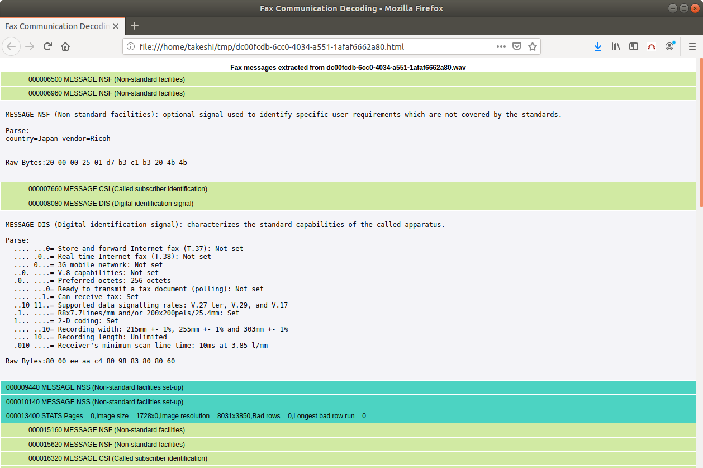

# fax_decoder
Simple tool to help to troubleshoot fax problems.
You provide a STEREO wav file with the recording of a fax call (with each side of the call in a different channel) and this tool will generate a web page where the T.30 messages present in the wav file can be inspected.

To use it, you will need to build and install spandsp fax_decoder:
```
sudo apt install build-essential make automake autoconf
sudo apt install libtiff-dev
sudo apt install libaudiofile-dev

git clone https://github.com/MayamaTakeshi/spandsp
cd spandsp
./autogen.sh
./configure
touch README
make
cd tests
./build_fax_decoder.sh
sudo cp fax_decoder /usr/local/bin
```

Then you need to have sox in your machine:
```
sudo apt install sox
```

Finally, you can use the app by doing:
```
./gen_html_page.py PATH_TO_WAV_FILE PATH_TO_HTML_FILE

```
Example:
```
./gen_html_page.sh dc00fcdb-6cc0-4034-a551-1afaf6662a80.wav dc00fcdb-6cc0-4034-a551-1afaf6662a80.html
```

Then just open the html file in your browser: 

